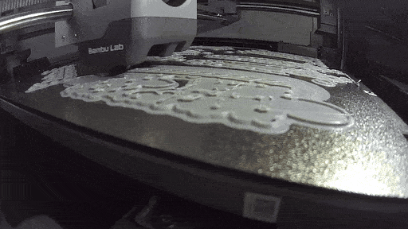

# Zeroth-01 Build

> Building the open-source Zeroth-01 humanoid — from 3D print to RL policy on real hardware.

[](LICENSE)
[](#build-log)
[](#this-build)

<!-- ─────────────────────────────────────────────────────────────
HERO SPOT — own footage only.
Currently: print timelapse. Upgrade to a motion clip as soon as
the arms move (swap the GIF, keep the caption honest).
────────────────────────────────────────────────────────────── -->



*All body parts fresh off the Bambu Lab P2S — assembly starts now.*

> 🚧 **Current status:** all parts printed — next up: servo bring-up & Phase 1 arm assembly.

Based on the **[Zeroth-01 by K-Scale Labs / Zeroth Robotics](https://github.com/zeroth-robotics/zeroth-bot)**. This repo documents my independent build of the platform and the software I write on top of it.

## What is the Zeroth-01?

A ~40 cm, 3D-printed, open-source humanoid robot platform designed for sim-to-real and reinforcement learning work, built around low-cost Feetech serial-bus servos.

Demo from the Zeroth-01 project (thumbnail links to YouTube):

[](https://www.youtube.com/watch?v=O6zqIltJcVw)

*The video above is external footage from the Zeroth-01 project, linked for context. Everything else in this repo is my own build.*

## Why this project

An end-to-end humanoid stack on affordable hardware, documented step by step: print & assemble → write the servo tooling (Python + C++) → train locomotion in simulation → deploy the policy on the real robot.

The goal is not just a finished robot, but a working sim-to-real pipeline with original tooling built along the way.

## This build

|                 |                                                        |
| --------------- | ------------------------------------------------------ |
| Platform        | K-Scale Zeroth-01 (~40 cm humanoid)                    |
| Actuators       | Feetech STS3215 (arms) · STS3250 (legs/torso, planned) |
| Onboard compute | Raspberry Pi 4 (4 GB)                                  |
| Printing        | Bambu Lab P2S — PETG                                   |
| Training rig    | Linux workstation, 2× RTX 3090 (local, no cloud)       |

## Build log

- **Phase 0 — Printing** ✅ : all body parts printed in PETG on the Bambu Lab P2S — timelapses in [media/](media/), print notes in [hardware/](hardware/)
- **Phase 1 — Arms** (STS3215): *next* — servo bring-up, assembly, first manipulation demos → [docs/](docs/)
- **Phase 2 — Legs & torso** (STS3250): planned — RL locomotion
- **Phase 3 — Full integration**: planned

Milestones are tagged as releases (`v0.1-parts-printed`, `v0.2-arms-assembled`, `v0.3-first-motion`, …) so the build history is easy to follow chronologically.

## Software

Original code in this repo (as opposed to upstream — see [acknowledgements](#upstream--acknowledgements)):

- **Python** — calibration & control scripts on top of PyKOS
- **C++ tooling** — Feetech packet parser, tick ↔ radian conversion, RAII serial-port wrapper
- **Planned** — real-time servo control node (rclcpp) with ONNX Runtime policy inference on the Pi 4

## Simulation & RL

MuJoCo/ksim-based training pipeline: train locomotion policies locally on the GPU rig, export to ONNX, run inference on the robot. Configs, reward notes, and sim-to-real findings live in [sim/](sim/).

## Repository structure

```
docs/       dated build-log entries & decisions
hardware/   print profiles, BOM, modifications
software/   python/ · cpp/
sim/        training configs, MJCF/URDF, sim-to-real notes
policies/   exported ONNX policies
media/      photos, print timelapses, hero GIF
```

## Lessons learned

*(Updated as the build progresses — print settings, servo quirks, sim-to-real gaps.)*

- **Why ~50 kg·cm servos are the ceiling for a 40 cm biped:** required joint torque scales roughly with L⁴ for geometrically similar robots — doubling size means ~16× the torque. That makes the STS3250 a hard limit at this scale; the next size class up requires Dynamixel-class actuators.

## Roadmap

- [x] Build plan & repository
- [x] Print all body parts in PETG (Bambu Lab P2S)
- [ ] Bench bring-up of the arm servos (STS3215): set IDs, verify comms, calibrate zero positions via PyKOS
- [ ] C++ serial tooling against the bench setup: Feetech packet parser, tick ↔ radian conversion, RAII serial-port wrapper
- [ ] Phase 1: assemble the arms (with pre-configured servos)
- [ ] First arm motion demos → new hero GIF
- [ ] Simulation setup: MJCF/URDF model running in MuJoCo/ksim
- [ ] Phase 2: assemble legs & torso (STS3250)
- [ ] Train a locomotion policy in simulation
- [ ] Real-time C++ control node (rclcpp) with ONNX Runtime inference on the Pi 4
- [ ] Sim-to-real: deploy the walking policy on the robot
- [ ] Phase 3: full integration — locomotion + arms

## Upstream & acknowledgements

This build stands on the open-source work of K-Scale Labs / Zeroth Robotics:

- [zeroth-robotics/zeroth-bot](https://github.com/zeroth-robotics/zeroth-bot) — the Zeroth-01 platform (hardware & docs)
- [kscalelabs/kos-zbot](https://github.com/kscalelabs/kos-zbot) — robot OS & hardware abstraction layer (Feetech drivers, calibration CLI)
- [kscalelabs/ksim](https://github.com/kscalelabs/ksim) — RL training library built on MuJoCo/JAX

See the upstream READMEs for the full ecosystem. This is an independent build log, not affiliated with K-Scale Labs.

## License

Original code and documentation in this repository: [MIT](LICENSE).
Upstream hardware, firmware, and design files remain under their respective upstream licenses.

---

Built by [Justin Riekehof](https://github.com/Justin-Riekehof) — simulation engineer (C++), working toward RL-based humanoid control.
