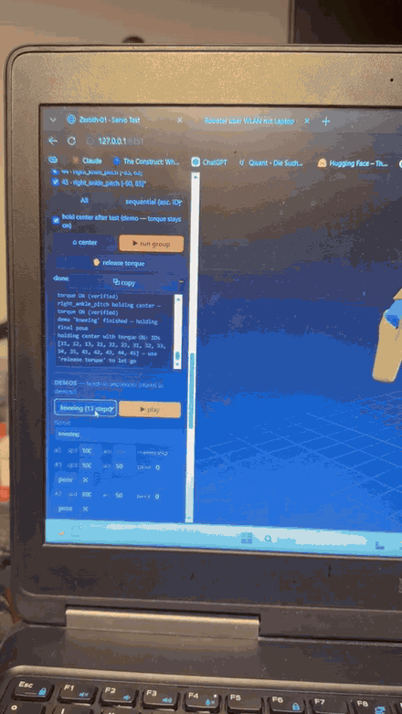
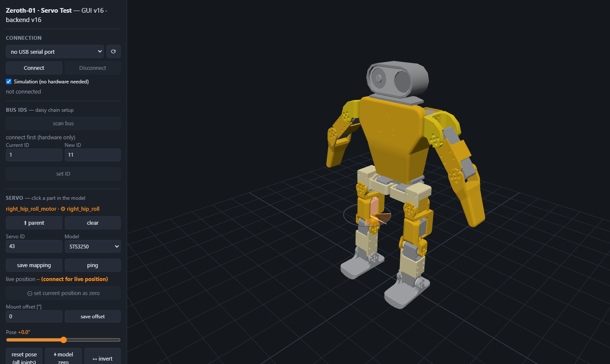

# Zeroth-01 Build

> Building the open-source Zeroth-01 humanoid — from 3D print to RL policy on real hardware.

[](LICENSE)
[](#build-log)
[](#this-build)

<!-- ─────────────────────────────────────────────────────────────
HERO SPOT — own footage only.
Currently: whole body running teach-in demos next to the live CAD
model. Upgrade when it walks untethered (swap the GIF, keep the
caption honest).
────────────────────────────────────────────────────────────── -->



*Whole body assembled: kneeling, standing back up and waving via taught-in demo sequences — the [Web GUI](src/servo_gui/)'s CAD model mirrors every move live (3× time-lapse; power & control still tethered to the bench PSU and a laptop).*

> 🚧 **Current status:** whole body assembled & calibrated — all 16 servos on the daisy chain, per-joint limits & mount offsets measured, teach-in motion demos running. **Wireless mode is live:** the onboard Raspberry Pi executes demos locally, the browser only sends intents. Next: C++ serial tooling, MuJoCo sim.

Based on the **[Zeroth-01 by K-Scale Labs / Zeroth Robotics](https://github.com/zeroth-robotics/zeroth-bot)**. This repo documents my independent build of the platform and the software I write on top of it.

## What is the Zeroth-01?

A ~40 cm, 3D-printed, open-source humanoid robot platform designed for sim-to-real and reinforcement learning work, built around low-cost Feetech serial-bus servos.

Demo from the Zeroth-01 project (thumbnail links to YouTube):

[](https://www.youtube.com/watch?v=O6zqIltJcVw)

*The video above is external footage from the Zeroth-01 project, linked for context. Everything else in this repo is my own build.*

## Why this project

An end-to-end humanoid stack on affordable hardware, documented step by step: print & assemble → write the servo tooling (Python + C++) → train locomotion in simulation → deploy the policy on the real robot.

The goal is not just a finished robot, but a working sim-to-real pipeline with original tooling built along the way.

## This build

|                 |                                                        |
| --------------- | ------------------------------------------------------ |
| Platform        | K-Scale Zeroth-01 (~40 cm humanoid)                    |
| Actuators       | Feetech STS3215 (arms) · STS3250 (legs/torso, planned) |
| Onboard compute | Raspberry Pi 4 (4 GB)                                  |
| Printing        | Bambu Lab P2S — PETG                                   |
| Training rig    | Linux workstation, 2× RTX 3090 (local, no cloud)       |

## Build log

- **Phase 0 — Printing** ✅ : all body parts printed in PETG on the Bambu Lab P2S — [print timelapse](media/print-timelapse.gif), print notes in [hardware/](hardware/)
- **Phase 1 — Arms** (STS3215) ✅ : assembled, IDs flashed (11–13 / 21–23), center-calibrated, per-joint safe limits measured on the bench (one torn elbow bracket later) — [hardware/joint_limits.json](hardware/joint_limits.json)
- **Phase 2 — Legs & torso** (STS3250): *in progress* — **whole body assembled & calibrated** (IDs 31–35 / 41–45, mount offsets incl. a +90° hip, hand-trimmed zeros), first **teach-in motion demos** running on the full body ([demos/](demos/)); RL locomotion still ahead
- **Servo test GUI** ✅ : browser tool for bring-up, testing, teach-in and visualization ([src/servo_gui/](src/servo_gui/), see [Software](#software))
- **Onboard compute / wireless mode** ✅ : shared motion core ([src/zbot_core/](src/zbot_core/)) + intent service on the Raspberry Pi ([src/pi_service/](src/pi_service/)) — demos execute on the robot, the GUI switches between USB (bench) and wireless (Pi) mode; one-command deploy ([docs/pi-service.md](docs/pi-service.md))
- **Phase 2 — Legs & torso** (STS3250): planned — RL locomotion
- **Phase 3 — Full integration**: planned

Milestones are tagged as releases (`v0.1-parts-printed`, `v0.2-arms-assembled`, `v0.3-first-motion`, …) so the build history is easy to follow chronologically.

## Software

Original code in this repo (as opposed to upstream — see [acknowledgements](#upstream--acknowledgements)):

### Servo test & visualization GUI — [src/servo_gui/](src/servo_gui/)

Browser-based tool (FastAPI + three.js) used to bring up and test the robot, built
around a **pinned OnShape CAD version** ([resources/cad/](resources/cad/)) so all
tooling refers to one immutable geometry state:


*Simulation mode with the calibrated model: select a leg joint, pose it with the slider (ground-contact display keeps the soles on the floor), then play the taught-in kneeling demo — the log streams limit clamping and load-sag compensation live (2.5× time-lapse).*

- **3D model, clickable** — select a servo in the CAD view; joint axes, rotation
  centers, zero references and the full kinematic tree are pulled from the OnShape
  assembly's mates, not guessed. Clicking a joint retrieves its configured bus ID;
  setting an ID auto-selects the matching joint
- **Bring-up & calibration** — bus scan, persistent ID flashing
  ([hardware/servo_ids.json](hardware/servo_ids.json)); live position readout of the
  selected servo; hand-turn the output and *set current position as zero* (mount
  offsets, e.g. a +90°-mounted hip, applied transparently everywhere)
- **Safety net** — per-joint limits ([hardware/joint_limits.json](hardware/joint_limits.json)),
  GUI-editable with left ↔ right mirroring and **enforced server-side** (every sweep
  and demo is clamped); *Stop* is always an E-stop; a watchdog re-parks holding
  joints that lose torque
- **Single & group runs** — sweep tests with a live 3D range gauge; group runs
  sequential (ascending ID) or simultaneous with presence detection (absent servos
  grayed out); **hold-center demo mode** keeps tested joints standing at center;
  load-sag compensation trims steady-state error so poses land where taught
- **Teach-in demos** — capture steps from the posed 3D model, from the
  **hand-posed real robot** (torque released) or as exact center; per-step and
  global speed/accel/pause; named sequences stored in [demos/](demos/), played back
  on hardware or in simulation (the model plays along live)
- **Grounded, calibrated visualization** — model zero pose calibrated to the real
  robot (display corrections + per-joint direction inversion), ground-contact
  heuristic that keeps the stance foot's sole flush on the floor ("gravity feel")
- **Simulation mode** — the full GUI works without hardware; version handshake
  warns loudly when frontend and backend get out of sync
- **Two operating modes** — *USB (local)*: adapter on the laptop, full bench
  tooling. *Wireless (Pi)*: adapter on the robot's Raspberry Pi; the browser
  sends **intents only** (play demo, stop, center, release, teach-in capture)
  to a Pi-side FastAPI service running the same shared motion core
  ([src/zbot_core/](src/zbot_core/)) — Wi-Fi jitter never sits inside a
  control loop, limits are enforced on the robot, and Stop is an E-stop in
  both modes. Teach-in works wirelessly too: hand-pose the robot, capture via
  the Pi, save — the repo stays canonical, the robot plays it immediately



*A clicked joint (`⚙ right_hip_roll`): the gauge ring sits on the CAD joint axis, the bus ID and min/max limits are retrieved from the repo configs, and the calibration tools (live position, re-zero, mount offset, model zero) are one click away.*

```
cd src/servo_gui
uv sync
uv run server.py        # -> http://127.0.0.1:8451
```

Details in [src/servo_gui/README.md](src/servo_gui/README.md); all conventions,
units, IDs and workflows are collected in the
**[User Manual](docs/User_Manual.md)**.

### Other

- **Python bench scripts** — first-contact servo test ([src/tests/](src/tests/))
- **C++ tooling** (next) — Feetech packet parser, tick ↔ radian conversion, RAII serial-port wrapper
- **Planned** — real-time servo control node (rclcpp) with ONNX Runtime policy inference on the Pi 4

## Simulation & RL

MuJoCo/ksim-based training pipeline: train locomotion policies locally on the GPU rig, export to ONNX, run inference on the robot. The build-specific MuJoCo model (16 DoF, real servo IDs, sys-ID'd STS3250/STS3215 actuator split) is generated from the upstream CAD assets by [sim/tools/build_model.py](sim/tools/build_model.py); the walking task runs on the GPU rig via `python -m sim.train.walking`. Setup, stack decision (post-K-Scale-shutdown state of the ecosystem) and sim-to-real notes live in [sim/README.md](sim/README.md).

## Repository structure

```
docs/       dated build-log entries & decisions
hardware/   servo docs & configs (IDs, joint limits, mount offsets), print notes
demos/      teach-in motion sequences (JSON, created & played via the GUI)
src/        servo_gui/ (web GUI) · zbot_core/ (shared motion core) ·
            pi_service/ (onboard intent API) · tests/ (bench scripts) · cpp/ (planned)
resources/  pinned CAD snapshots (immutable OnShape version pins)
sim/        training configs, MJCF/URDF, sim-to-real notes
policies/   exported ONNX policies
media/      photos, print timelapses, hero GIF
```

## Lessons learned

*(Updated as the build progresses — print settings, servo quirks, sim-to-real gaps.)*

- **Why ~50 kg·cm servos are the ceiling for a 40 cm biped:** required joint torque scales roughly with L⁴ for geometrically similar robots — doubling size means ~16× the torque. That makes the STS3250 a hard limit at this scale; the next size class up requires Dynamixel-class actuators.

## Roadmap

- [x] Build plan & repository
- [x] Print all body parts in PETG (Bambu Lab P2S)
- [x] Servo test & visualization GUI (FastAPI + three.js) on a pinned CAD version — joint axes, kinematics and safety limits from/against the CAD data
- [x] Bench bring-up of the arm servos (STS3215): daisy-chain IDs (11–13 / 21–23), comms verified, center calibration at tick 2048
- [x] Phase 1: assemble the arms → upper body assembled & calibrated, per-joint safe limits measured
- [x] First arm motion demos → new hero GIF
- [x] Phase 2 assembly: legs & torso (STS3250, IDs 31–35 / 41–45) → whole body assembled, calibrated (mount offsets, limits) — teach-in demos (kneeling, waving) run on the full body
- [x] Onboard the Raspberry Pi: shared motion core (`zbot_core`), Pi intent service with watchdog scaffold + one-command deploy, GUI wireless mode — demos run untethered from the laptop's USB port
- [ ] C++ serial tooling against the bench setup: Feetech packet parser, tick ↔ radian conversion, RAII serial-port wrapper
- [x] Simulation setup: build-specific MJCF model (16 DoF, sys-ID'd Feetech actuators) running in MuJoCo/ksim — GPU training pipeline verified end-to-end ([sim/](sim/README.md))
- [ ] Train a locomotion policy in simulation
- [ ] Real-time C++ control node (rclcpp) with ONNX Runtime inference on the Pi 4
- [ ] Sim-to-real: deploy the walking policy on the robot
- [ ] Phase 3: full integration — locomotion + arms

## Upstream & acknowledgements

This build stands on the open-source work of K-Scale Labs / Zeroth Robotics:

- [zeroth-robotics/zeroth-bot](https://github.com/zeroth-robotics/zeroth-bot) — the Zeroth-01 platform (hardware & docs)
- [kscalelabs/kos-zbot](https://github.com/kscalelabs/kos-zbot) — robot OS & hardware abstraction layer (Feetech drivers, calibration CLI)
- [kscalelabs/ksim](https://github.com/kscalelabs/ksim) — RL training library built on MuJoCo/JAX

See the upstream READMEs for the full ecosystem. This is an independent build log, not affiliated with K-Scale Labs.

## License

Original code and documentation in this repository: [MIT](LICENSE).
Upstream hardware, firmware, and design files remain under their respective upstream licenses.

---

Built by [Justin Riekehof](https://github.com/Justin-Riekehof) — simulation engineer (C++), working toward RL-based humanoid control.
