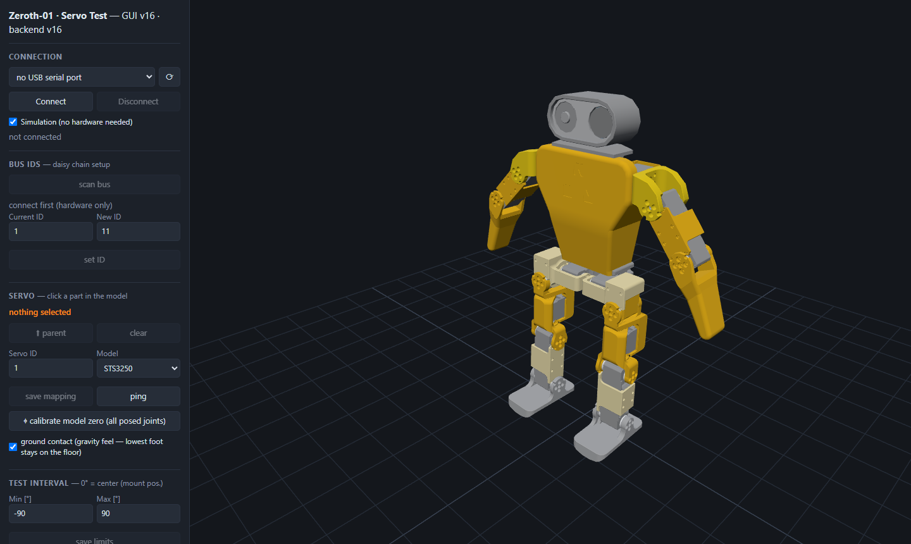

# Servo test GUI

> Units, conventions, ID tables and workflows: **[User Manual](../../docs/User_Manual.md)**

Browser GUI to test the Zeroth-01's servos (STS3215 / STS3250) with a 3D view of the
CAD model — click the servo you are testing, set the position interval, and watch the
range gauge + live position while the test runs. Joints are posable via sliders, and
group runs (sequential / simultaneous) animate the whole rig.




## Run

PowerShell (Windows):

```powershell
cd src\servo_gui; uv sync; uv run server.py
```

Bash (Ubuntu/macOS):

```bash
cd src/servo_gui && uv sync && uv run server.py
```

Open <http://127.0.0.1:8451>. Fully offline-capable: the 3D libraries (three.js
0.160.1) are vendored in `static/vendor/` and the CAD model is served from the repo —
no internet needed.

## CAD model

The viewer loads the **pinned OnShape version** from
`resources/cad/z001-opus-m-93de7567.glb` (see [resources/cad/VERSION.md](../../resources/cad/VERSION.md)).
If the file is missing, the GUI shows instructions — either run
`python resources/cad/download_model.py` (needs free OnShape API keys) or export the
GLB manually from the pinned URL and drag & drop it into the GUI window.

## Usage

1. **Connection** — pick the COM port of the Waveshare bus servo adapter and *Connect*
   (12 V on, jumper on B, one servo attached — same bench setup as
   `src/tests/servos/sts3250_test.py`). Or leave **Simulation** checked to try
   everything without hardware.
2. **Servo** — click the part in the 3D model that corresponds to the servo on the
   bench. Clicking a motor also **ticks it in the *Servos* list** (and colours it
   orange); clicking it again unticks it, and the list/region chips highlight the
   model in return — orange always means "selected", in both directions.
   *save mapping* remembers servo ID + model per CAD part (stored in
   `servo_map.json`) — and, when the part belongs to a CAD joint, also
   updates the canonical joint → ID config
   ([hardware/servo_ids.json](../../hardware/servo_ids.json)) that drives the
   group runs. Onboarding new servos (e.g. the legs) is therefore fully doable
   from the GUI: flash the ID (*Bus IDs*), click the joint, *save mapping*.
3. **Joint range** — set min/max in degrees **relative to the center position**
   (see calibration convention below; seam-safe limits ±176.5° are enforced).
   *save limits* stores them as the joint's enforced range; this works in
   **wireless mode too**, where the values go to the repo *and* to the robot,
   which enforces them from the next run on (no redeploy).
4. **Test run** (USB only) — speed, acceleration, cycles. *Run test* pings the
   servo, moves to min, then sweeps min → max → min. The orange sector in the 3D
   view shows the interval (gray marker = 0° center); the white needle is the live
   position. Torque is always disabled at the end — also on *Stop* or error.

## Calibration convention

Before mounting a printed part, move the servo to its **center position** with the
*⌂ Move to center* button: tick 2048 = 180° absolute. The part is then mounted in its
neutral pose, giving **±180° of travel in both directions** (±176.5° with seam-safety).
All angles in the GUI and API are **relative to this center** — 0° = mount position,
negative = one direction, positive = the other.

The **gauge axis** dropdown only orients the visualization ring; it does not affect
the hardware.

**Mount offset / re-zeroing.** If a joint can't be mounted exactly at center (gear
spline resolution, or a deliberate ±90° mount), select it and use **⊙ set current
position as zero**: move to center, hand-turn the output to where zero should be
(torque is off after the move), then click — the current encoder position becomes the
joint's 0° and the offset is stored in
[hardware/joint_offsets.json](../../hardware/joint_offsets.json). The **live position**
readout (shown when connected) tracks the current angle as you turn. All limits/tests
stay in CAD-frame degrees; the offset is applied transparently.

## Teach-in demos

Pose the 3D model with the per-joint sliders, then *+ add step (current pose)* in
the **Demos** section — each step stores the target angles of all configured joints
plus its own speed/accel/pause. *save demo* writes the sequence as JSON into
[demos/](../../demos/) in the repo; the dropdown lists all saved demos for playback
(simulation or hardware). Playback clamps every target to the joint limits, skips
servos not on the bus, animates the model live, and holds the final pose
(*✋ release torque* lets go). See [demos/README.md](../../demos/README.md) for the
file format.

## Safety

- Output shaft must be free to rotate — same rule as the bench test.
- Position limits keep distance to the 0/4095 encoder seam
  (see the comment block in `sts3250_test.py` for why).
- Torque is released at the end of every run — except joints parked by the
  **hold center** demo mode, which keep holding until *✋ release torque*.
  *Stop* always cuts torque on everything (E-stop).
